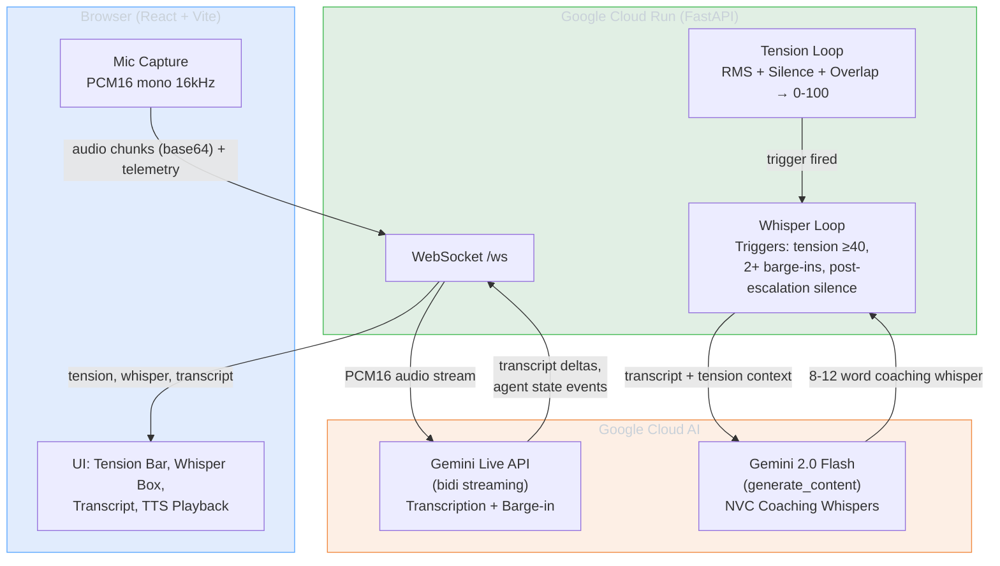

# Empathic Co-Pilot – Architecture

## System Diagram

## Components

| Component | Role |
|-----------|------|
| **Browser (React/Vite)** | Captures mic audio (PCM16 16kHz), sends base64 chunks + RMS telemetry via WebSocket. Displays tension bar, live transcript, coaching whispers. Speaks whispers aloud via Web Speech API. |
| **Cloud Run (FastAPI)** | Accepts WebSocket at `/ws`. Runs tension scoring loop (RMS, silence, overlap → 0-100). Runs whisper loop with 3 deterministic triggers. Streams audio to Gemini Live for transcription. Calls Gemini Flash for AI-generated coaching. |
| **Gemini Live API** | Real-time bidirectional audio streaming. Provides transcript deltas and supports barge-in (stop generation when user interrupts). |
| **Gemini 2.0 Flash** | Generates contextual 8-12 word coaching whispers grounded in NVC (Nonviolent Communication) and active listening. Called on-demand when tension triggers fire. Falls back to fixed phrases if unavailable. |

## Data Flow

1. **Audio In:** Browser captures mic → resamples to 16kHz PCM16 mono → base64-encodes → sends via WebSocket with RMS telemetry
2. **Tension Scoring:** Backend computes tension (0-100) from RMS volume, silence duration, and interruption overlap every 0.5s
3. **Transcription:** Backend streams PCM16 to Gemini Live API → receives transcript deltas → forwards to browser
4. **Barge-in:** When user speaks over agent output (RMS ≥ threshold), backend calls `stop_generation()` and emits `interrupted` event
5. **Coaching:** When a trigger fires (tension cross, barge-in count, post-escalation silence), backend sends transcript + tension context to Gemini Flash → receives contextual coaching whisper → sends to browser
6. **Audio Out:** Browser receives whisper text → speaks it aloud via Web Speech API (soft, slow voice)

## Deployment

- **Backend:** Single container on Cloud Run (see [CLOUD_RUN_DEPLOY.md](./CLOUD_RUN_DEPLOY.md)). Uses ADC for Vertex AI or API key.
- **Frontend:** Static build (`npm run build`). Set `VITE_WS_URL=wss://YOUR_SERVICE_URL/ws` to target Cloud Run.
- **IaC:** Deployment scripts at `infra/cloudrun/deploy.sh` (Bash) and `deploy.ps1` (PowerShell).
