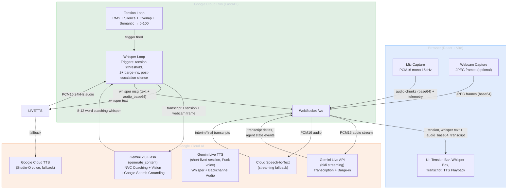

# Empathic Co-Pilot – Architecture

## System Diagram

```mermaid
graph TB
    subgraph Browser ["Browser (React + Vite)"]
        MIC["Mic Capture<br/>PCM16 mono 16kHz"]
        CAM["Webcam Capture<br/>JPEG frames (optional)"]
        UI["UI: Tension Bar, Whisper Box,<br/>Transcript, TTS Playback"]
    end

    subgraph CloudRun ["Google Cloud Run (FastAPI)"]
        WS["WebSocket /ws"]
        TL["Tension Loop<br/>RMS + Silence + Overlap + Semantic → 0-100"]
        WL["Whisper Loop<br/>Triggers: tension ≥threshold,<br/>2+ barge-ins, post-escalation silence"]
    end

    subgraph GCP ["Google Cloud AI"]
        LIVE["Gemini Live API<br/>(bidi streaming)<br/>Transcription + Barge-in"]
        FLASH["Gemini 2.0 Flash<br/>(generate_content)<br/>NVC Coaching + Vision<br/>+ Google Search Grounding"]
        LIVETSS["Gemini Live TTS<br/>(short-lived session, Puck voice)<br/>Whisper + Backchannel Audio"]
        CLOUDTTS["Google Cloud TTS<br/>(Studio-O voice, fallback)"]
        STT["Cloud Speech-to-Text<br/>(streaming fallback)"]
    end

    MIC -- "audio chunks (base64) + telemetry" --> WS
    CAM -- "JPEG frames (base64)" --> WS
    WS -- "tension, whisper text + audio_base64, transcript" --> UI
    WS -- "PCM16 audio stream" --> LIVE
    LIVE -- "transcript deltas,<br/>agent state events" --> WS
    TL -- "trigger fired" --> WL
    WL -- "transcript + tension + webcam frame" --> FLASH
    FLASH -- "8-12 word coaching whisper" --> WL
    WL -- "whisper text" --> LIVETTS
    LIVETTS -- "PCM16 24kHz audio" --> WL
    LIVETTS -. "fallback" .-> CLOUDTTS
    WL -- "whisper msg (text + audio_base64)" --> WS
    WS -- "PCM16 audio" --> STT
    STT -- "interim/final transcripts" --> WS

    style Browser fill:#1f6feb22,stroke:#58a6ff,color:#c9d1d9
    style CloudRun fill:#23863622,stroke:#3fb950,color:#c9d1d9
    style GCP fill:#f0883e22,stroke:#f0883e,color:#c9d1d9
```

## Components

| Component | Role |
|-----------|------|
| **Browser (React/Vite)** | Captures mic audio (PCM16 16kHz) and optional webcam frames (JPEG). Sends base64 chunks + RMS telemetry via WebSocket. Displays tension bar, live transcript, coaching whispers. Plays whisper and backchannel audio via Web Audio API (PCM16 24kHz from Gemini Live TTS). |
| **Cloud Run (FastAPI)** | Accepts WebSocket at `/ws`. Runs tension scoring loop (RMS, silence, overlap, semantic escalation markers → 0-100). Runs whisper loop with 3 deterministic triggers. Streams audio to Gemini Live for transcription. Calls Gemini Flash for coaching text with optional webcam frame (vision) and Google Search grounding. Uses Gemini Live TTS (Puck voice) for whisper and backchannel audio, with Cloud TTS (Studio-O) as fallback. |
| **Gemini Live API** | Real-time bidirectional audio streaming. Provides transcript deltas and supports barge-in detection via `stop_generation()`. Also used for TTS: short-lived sessions generate natural whisper and backchannel audio with the Puck voice. |
| **Gemini Live TTS** | Primary audio synthesis for coaching whispers and backchannel ("Ok.", "I see."). Opens a short-lived Gemini Live session with the Puck voice to speak coaching text in a soft, intimate tone. Produces natural, human-like speech — the key differentiator from robotic TTS. Audio is post-processed (low-pass smoothing + amplitude reduction) for a whisper effect. |
| **Google Cloud TTS** | Fallback audio synthesis using Studio-O voice with SSML prosody (soft, slow). Used when Gemini Live TTS is unavailable. Same whisper post-processing applied. |
| **Gemini 2.0 Flash** | Generates contextual 8-12 word coaching whispers grounded in NVC (Nonviolent Communication) and active listening. Accepts optional webcam frame for body-language-aware coaching. When `COACHING_GROUNDING=1` (default), uses Google Search tool for evidence-based conflict resolution guidance. Falls back to fixed phrases if unavailable. |
| **Cloud Speech-to-Text** | Streaming fallback transcription when Gemini Live does not emit transcript. Provides interim and final results for real-time UI updates. |

## Data Flow

1. **Audio In:** Browser captures mic → resamples to 16kHz PCM16 mono → base64-encodes → sends via WebSocket with RMS telemetry
2. **Vision In (optional):** Browser captures webcam → JPEG frame → base64 → sends via WebSocket; backend stores latest frame for coaching context
3. **Tension Scoring:** Backend computes tension (0-100) from RMS volume, silence duration, interruption overlap, and semantic escalation markers every 0.5s
4. **Transcription:** Backend streams PCM16 to Gemini Live API → receives transcript deltas → forwards to browser. Cloud Speech-to-Text provides streaming fallback.
5. **Barge-in:** When user speaks over agent output (RMS ≥ threshold), backend calls `stop_generation()` and emits `interrupted` event
6. **Coaching:** When a trigger fires (tension cross, barge-in count, post-escalation silence), backend sends transcript + tension context + optional webcam frame to Gemini Flash (with Google Search grounding) → receives contextual coaching whisper → sends to browser
7. **Audio Out:** Backend opens a short-lived Gemini Live session (Puck voice) to speak the coaching text as natural whisper audio → receives PCM16 24kHz → applies whisper post-processing (smoothing + amplitude reduction) → sends as `audio_base64` in whisper message. Falls back to Cloud TTS (Studio-O) if Live TTS fails. Backchannel audio ("Ok.", "I see.") uses the same Gemini Live TTS voice and processing pipeline. Browser plays via Web Audio API.

## Deployment

- **Backend:** Single container on Cloud Run (see [DEPLOY.md](./DEPLOY.md)). Uses ADC for Vertex AI.
- **Frontend:** Static build (`npm run build`). Set `VITE_WS_URL=wss://YOUR_SERVICE_URL/ws` to target Cloud Run.
- **IaC:** Deployment scripts at `infra/cloudrun/deploy.sh` (Bash) and `deploy.ps1` (PowerShell).
